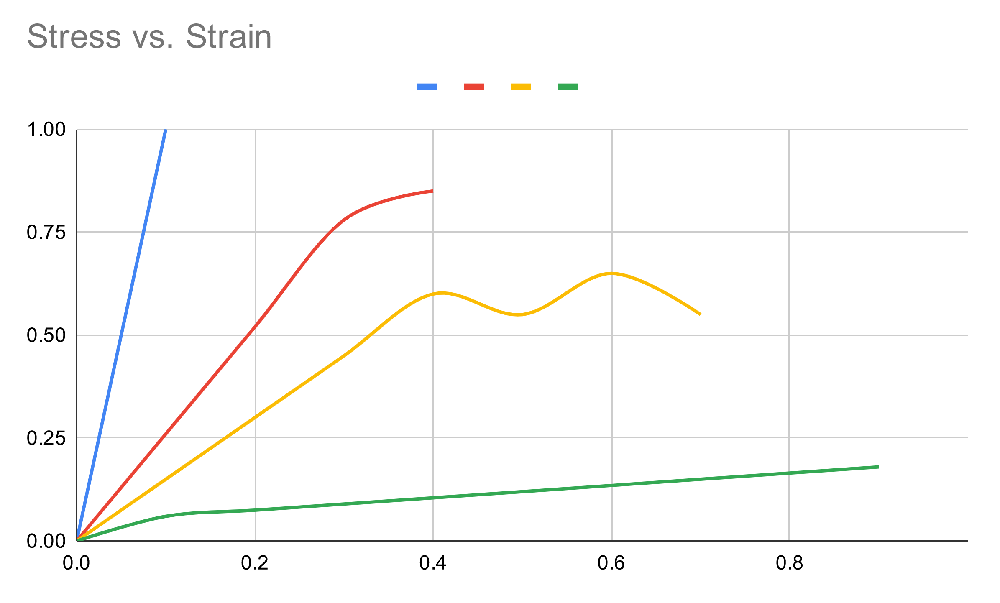

Check out the most up to Date Project details on the [Github!](https://github.com/nerd-sniped/RIGCNC)

The overall goal of the project was to put together a passably rigid and inexpensive CNC mill capable of taking fairly heavy cuts (by maker standards) with minimal prerequisite machine tools(for assembly) while still being small and portable** The finished project can be completed with a good quality hand drill and a 3D printer.  The conception of the project began when I realized you can buy "A" grade granite surface plates as well as precision steel right angles for less than $250. This gives a precision rigid base with a vertical section similar to a VMC.

**By portable I mean moveable without rigging.  I live in a NYC apartment, I wanted a mill I could disassemble, put in my car and move somewhere.   The final mill is ~200 lbs. but breaks down into a few pieces that are 80lbs or less.

### Goals/Requirements

The design of RIGCNC machine was created with a design principle I learned about from the guys over at machine agency(go check out thet Jubilee 3D printer , its awesome), they call it fabricatability.   They explained it quite well on the Jubilee Printer page.  below is an exerpt from their github page.

- the design should be reproducible in single quantities without relying on high volume purchases

- the constituent components should be broadly accessible to an international audience

- the design should present all necessary trade-specific knowledge up-front via documentation

- the design should be reproducible with commonly available unspecialized fabrication equipment

- the design should maximize compatibility with generic stock parts where possible

- Think of it as a specific flavor of design-for-manufacturing where the manufacturer is a single person, someone who may not have access to milling and turning machines or the knowledge of how to use them. This person also shouldn't need the fine motor skills of an experienced craftsperson to assemble parts.

I think this just beautifully summarizes the design decisions I tried to make.  The goal was to purchase rigidity and precision where possible.

## Theory of Construction-Long and Nerdy

The following section is long and nerdy. the TL;DR is:

- Everything is a spring, keep things in either tension or compression to keep it rigid and strong

- Short Load Paths ensure the most efficient use of your materials. If you can support your loads where they occur the machine will be much more rigid.

- Material selection can be a factor, you can use mass to your advantage. Especially when vibrations and damping are considerations. Increasing the Inertia (mass) of the cutting assembly will make it want to move less. This is especially beneficial when considering tool chatter.

- Precision components are only useful if they are properly constrained

- Precision components are only as precise as your least precise component in your precision "chain"

### Design philosophy

The goal of this build was to purchase rigidity and precision when applicable. A mill has to do two things to be useful; Accurately place the head of the mill at a prescribed location (relative to a work piece) and keep it there while it is being acted on by external forces (cutting forces). Rigidity is key to both of these goals. There is no downside to having a rigid machine.

The following article should read as various thoughts one should have in mind while pondering/building a mill. I break many of the rules of design while building my mill, (hopefully) for defensible monetary or convenience reasons. When building a hobby-grade mill certain concessions have to be made. I am going to do my best to use qualitative language instead of jumping right into numbers, the goal here is to convey insight and not preach.

Most mills in this price point (<$1500) are not rigid.  This is often due to poorly defined design goals. Many people start out with a "goal" of cutting large sheets of wood AND small aluminum parts. These are conflicting goals.

The goal of this design is to cut small parts, out of steel or aluminum. Spindle speed will be slow and have good torque for large(ish) endmills.  This is in contrast to most hobby mills out there that use Chinese spindles.  These typically operate at much higher RPM and need very tiny endmills to run effectively. (I do plan on adding a high-speed spindle to the head eventually) A high-speed spindle and a low-speed spindle have complementary strengths and weaknesses.

### Broad summary of how a mill works

A mill removes material from "stock" to create a part. This is done by spinning a tool (often a sharp blade shaped like a helix) against the stock to cut small pieces away. [It's important to note that the material is being CUT not abraded away]

Removing this material from the stock exerts a reaction force on the end mill.  Newton's Third Law... This force travels through the components of the assembly taking the path of least resistance, similar to electricity.

This path is called the load path (the path the load takes... 10/10 for engineering naming creativity).  As the load travels through the assembly, each of the components in the loading path receives some portion of the load, deflect a small amount, and pass the remaining load onto the next component. How much each component deflects, and consequently how rigid a machine is, is determined by geometry (in the context of the full machine) and the material.  Typically the smaller the component (at least in cross-sectional area) the more it will deform, if it deforms too much it breaks.  A rigid machine will usually have short load paths and use rigid materials with large cross-sections of material in high load areas.

#### Lets talk about mill (or machine) design.

A mill (as described above) needs to predictably move a end mill around while being acted on by external forces. This boils down to a rigidity requirement. More rigid = more better.

To make something rigid, typically there are two high level parameters to manipulate.

**Material**

**Geometry**

*A well-designed mill will intelligently mix the two and use them together to achieve the desired goal.*

### Now lets talk material(s)

A fundamental truth of the universe that needs special attention when designing machines is EVERYTHING is a spring.  When a force is applied to an object, the object pushes back. The act of the object pushing back is actually the object deforming and storing potential energy.  when a small force is applied to an object it will bend, when the force is removed it returns to its original shape. This is called elastic deformation, in the elastic deformation range, materials follow Hooks Law (IE they behave and can be modeled like a classic spring).  Each material has an upper limit to the amount of energy it is capable of storing before it begins to deform, surpassing this "limit" will cause the material to deform permanently.  This is called plastic deformation.

Plastic deformation almost always means the part has been "broken". A permanent change from the designed shape is rarely a design feature (unless the design is meant to absorb impact or high forces in which case the design is 1-time use) Plastic deformation is also an indicator that the force is approaching the yield strength of the material, this is the point at which a material actually begins to break apart.  Every material behaves differently and this is often shown in a stress vs. Strain graph (Engineers LOVE graphs).  Some materials have large elastic deformation ranges, some materials have very small or short elastic ranges. This is how we quantify the material differences between for example rubber and steel.

In the above graph, Blue is a hard brittle material, red is a strong semi ductile material, Yellow is a ductile material that bends a lot, green is a "plastic" material meaning it bends quickly but remains flexible and is difficult to break.  The point at which the graph ends is where the material will break.

When designing for rigidity, the goal is to minimize the amount of deflection that occurs, in other words, minimize the amount of elastic deformation that is experienced. This typically means picking a rigid material (Blue/Red lines above) and using a sufficient amount of the material to resist the expected force.  An example of a rigid design is a laboratory microscope. These are often built from a large metal casting and would probably withstand having a car parked on top of them. The large amount of material is present to make the microscope sufficiently stiff (low on its elastic deformation range) to take very small measurements.

Another parameter to consider when talking about materials is density.  A materials density affects the frequency response and mechanical impedance of the machine, both of which are a bit beyond the scope of this write-up.  Generally more heavy = more better.  A heavier machine is often more rigid, part of that is because the machine components are literally harder to move.

I would like to note, usually, weight is a constraint in engineering design. Race cars, Spaceships, Bridges, typically need to be light, rigid, and strong.  A mill has the design luxury of being capable of being heavy and still perform well. No commercially available hobby mill uses heavy castings of granite or steel, this is most likely due to shipping costs...  Ain't nobody want to pay for that.

Material selection is also the point at which economics begins to enter the design thought process.  Metal castings are chosen for a microscope because they are economical,  A diamond microscope would be more rigid, but would cost quite a lot of money and be difficult to manufacture.  A wood microscope would cost a lot less money but would not be very rigid.  A large part of engineering design is knowing how to work around budgetary constraints.

Now to talk about Geometry
More triangles = more better

Triangles are widely agreed to be the strongest shape, especially when talking about designing structures, but why is that? The short answer is a triangle is the only shape where loading the joints results in pure tension and compression loading.  If one imagines a square, and a load is applied to one of the corners of the square, the square can "flatten" to a rhombus or a diamond without any of its segments lengthening or shrinking.  With a triangle, if a load is applied to one of the joints, the segments need to either shrink or expand before the shape changes.

A more intuitive example might be, If someone hands you a stick and tells you to break it in half, you don't try to push it from the ends or pull it apart, you crack it in the middle because intuitively, that is the weakest direction. This bending of the stick is called a bending moment load (again engineers are 10/10 on naming things). A rigid/strong design will typically try to avoid these bending moments, this is because direct compression and tension are the loading cases that most efficiently use the properties of the material. When an object is subjected to a bending load, it experiences compression & tension at the same time. 

Bending_Load.png
This usually results in a large(r) amount of deflection compared to a pure tension or pure compression load since the load is experienced over a smaller area and therefore is higher in magnitude (A neutral axis that runs through the part "wastes" some of the material that is available to resist the load)

That being said, bending moments are unavoidable when designing things, the goal should be to avoid them when possible, not avoid them at all cost. From a load handling standpoint triangles are the most efficient shape to ensure loads are handled in purely tension or compression.  This is why engineers love them so much.

There is a "cheat" method a designer can use when weight is of no concern, or to your advantage, such as when designing mills, dams, roads. That is to throw more material (mass) at the problem.  While a triangle is great, a block of the same material will be stronger. This mill design has no explicit triangles but there are a lot of sections where material mass is utilized to the designs advantage.

In Summary, make the load paths as short as you can, use strong materials, and use triangles!

Some final thoughts on construction:
9 out of 10 times a hobby machine is rigidity limited, when it is rigid "enough" it’s power limited. Spindle power is usually not the weakest part, I see a lot of people online putting a 2 kW spindle on a machine that won't be able to take more than a 200 watt cut before it starts shaking itself apart...

Similarly, Spindle Power and Spindle Speed are two numbers that are thrown around often without much context or discussion.  Most people buy a big number without thinking about what they are trying to cut.  A 2 kW spindle that operates at 24k rpm is usually not a good match for most hobbyist stock materials.

Surface Speeds and feeds are beyond the scope of this discussion, but broadly, each material and endmill combination will have an "optimal" speed at which the cutting blade interacts with the material. A larger end mill requires a slower spindle RPM to have the same surface speed relative to the stationary stock material. A spindle that spins at 24k rpm logically then should be operated with a very small diameter endmill to maintain the optimal surface speed (1mm and under). Often people try to run large-sized (3mm and over) and either turning their spindle speed down (getting way less power than advertised from their machines) or run their mill very quickly. Both of these things would be fine if the machine was VERY rigid, but often it's not, which results in chatter and poor cutting quality.  People will then back off on the cut depth and width until the cut quality improves. Usually, this leaves people taking ridiculously small cuts... with their large expensive 2 kW high-speed spindle, often a much smaller spindle would be able to deliver just as much power.   Often the number can be fudged for soft materials such as MDF or plastic, but something unforgiving like steel keeps a machine's abilities pretty honest.

2. Research
I knew from the start that the base of the mill was going to be granite.  A Grade "A" surface plate from amazon seemed like an absolute steal at ~$130 (free shipping with prime), adding a precision machined right angle support was another ~$120 from Misumi. After finding those two components I knew it was "game on" for the rest of the design.

Base
The base from a part perspective was just going to be the granite block and the steel upright from Misumi. To connect them I would need to drill into the granite and epoxy in Steel concrete anchors.  these are rated for building magnitude loads so it shouldn't be an issue for a small mill.

Linear System
The first avenue I went down was to purchase linear motion rails pre-built from China.  These can be purchased as "linear tables" on eBay and websites such as Alibaba.  they come with 2 linear bearings blocks on precision rails and ball screws.  This is perfect for mills since they are rated for ridiculous loads compared to their size.

Capture (1).png
There are 2 major flaws in the design of these pre-built linear stages when looking at them for rigidity.

The first issue is the tables only come with 2 bearing carriages. Typically you want 4 linear bearings per axis, it more evenly distributes the load and is how the bearings are designed to work. This could be rectified by adding 2 bearings and building a custom table, so it is not the end of the world.   The real flaw and the reason these would not be rigid, is the ball screws are supported by cantilevered blocks.  This is a large bending moment on the precision part that is supposed to be rigid, very bad news...

In lieu of these pre-built linear stages I realized I was going to have to design and build my own, I liked the general layout and construction of the linear stages, just not the details of how they were put together. 

At this point I looked to open-builds as a convenient way to quickly build a precision system that other people could build for themselves.  After a bit of design work I came up with a design that uses;

2 custom end-plates (3D printed)

2 lengths of 20 x 20 extrusion ( I used open builds V rail stuff)

1 length of Openbuilds C-Beam

2 lengths of linear bearings (2 carriages each)

1 length of ball-screw

Various hardware and connectors common to the open-builds system

Linear_Stage.png
What I had essentially designed was a linear stage to stand in for the Chinese one. this one simply had shorter load paths and was built with rigidity in mind. This would become 1 axis of the CNC machine.  Creating 3 of these assemblies would be the X,Y, and Z-axis necessary to make a mill.

The key design upgrade (and the HOW of why the load paths are shorter) is the fact that the ball-screw supports are bolted directly to the endplates.  These plates are supported by the entire face of the extrusion which keeps it from being able to flex.  The removal of the cantilevered plate from the ballscrew load path should greatly increase the rigidity of the system.  It helps that the cross sectional area of the open builds assembly I made was more rigid to begin with. 

Mill Head
This component is the one that is most job specific.  A jeweler or someone who works with watch gears is going to have different cutting requirements than someone who is trying to hog out large Aluminum brackets.  My original plan was to go down the typical route of a Chinese VFD controlled mystery spindle. My logic being this machine (hopefully) would be more rigid and I could get a semi decent cut out of it.  The more I thought about it though the more I wanted something that could take large endmill cuts out of aluminum or steel.  This is not a good fit for a high speed spindle.

Researching a bit more I found you can buy a complete milling head for a harbor freight style milling machine (Sieg X2) for less than $150 (I would like to note I bought ONLY the head and then fit a brushless motor onto it, that ended up being a pain in the butt. If I had to do it over again I would have purchased the complete assembly with the motor and everything to have a completed mill faster. This assembly is just under ~$400 but when you consider the second casting ($80) you need to purchase + the Brushless motor ($120) + the power supply ($80) you're above $400 anyway. granted the AC motor is very underpowered but beggars can't be choosers) This assembly has the huge benefit of being made from cast iron(inline with “adding mass” as discussed above), as well as having an r8 spindle taper which opens up the future possibility of both a collet based tooling system (such as tormachs TTS) as well as adding an air release to the collet, allowing for fully automated tooling changes.  both of these are HUGE benefits in my eyes.  Mostly for the cool factor, but it also has real-world practical benefits.

Milll_head.png
Since the majority of the mill head is pre made and pre assembled there isn't much to be done besides connecting it to the rest of the assembly.  I did this with 6 drilled and tapped holes, cast iron drills easily and almost any drill can easily handle it.  I made a 3D printed template to make sure everything stayed in alignment.

Motion Control
Honestly anything will work. I ended up using Nema 23 high torque steppers from Openbuilds, mainly because that is what I had on hand.  For electronics I am using a Blackbox from Openbuilds as well, along with their new “Interface” system. Its a headless CNC controller now and I love not needing to have a nice laptop next to the oily, hot, metal chip-making tool.

Below are a few other common CNC options. I have opinions on all of them but I am not a software person and it would be irresponsible of me to try to be.  I used the BlackBox because I already had one.  It was very easy to set up.

GRBL + Arduino

Acorn CNC

Arduino + External Stepper Drivers

Gecko Drive + Arduino

ChiliPeppr and TinyG

3. Design/CAD
Time to actually design the thing!

CAD unfortunately is one of those things that takes a long time, is full of little nuggets of knowledge and insight but is dreadful to observe and hard to make watchable.  This project essentially boiled down to a few custom 3D-printed plates which could easily be made on a drill press, meaning the CAD is even more boring.  I will attach  drawings for those who either want to make the custom plates themselves or commission them to be made.  CAD for this project was more useful as a BOM generator than anything else.

I am contemplating offering hardware “kits” as well as aluminum plate “kits” for purchase to those who are interested.  Please drop me a line here if that is something that would interest you, if the interest is high enough I will do it. I want the build to be Opensource (especially for makers and schools and stuff who could use it for commercial purposes) so I will release the drawings for free. I am not opposed to releasing STL’s and Steps of the assemblies but I need person to person contact for that. I just don't want the design out there on its own ready to be picked up by bot crawlers and redistributed throughout the interwebs.

While making the CAD there were a few key insights that are worth sharing;

I designed the end plates of the linear system to have a convenient-to-purchase ratio. If you want a 400 mm linear stage, you buy 2x 400mm linear bearing carriages, 400 mm 20x20 aluminum, 400mm C Beam and 500 mm ball screws. Makes upgrading the length super easy, no weird cut lengths.

There are a few holes that need to be cut in both the casting for the mill head as well as the Misumi upright. These hopefully aren't too terrible to do, they’re low tolerance meaning close enough is good enough

I created 3d printable jigs to align all of these holes and hopefully make it easier to put the holes where they are meant to be.

Table.png
Z_axis.png
XY_table.png
4. Build

Figured I should start with the money shot (again) of the whole thing assembled ;D

All the parts went together pretty easily, there were a few hiccups along the way but its not really a DIY project if it goes completely smoothly.

Rough BOM
Granite Plate

Misumi Upright

Milling Head

Linear Rails

BallScrews

OpenBuilds parts

Base Construction

Since the base was partially the genesis of the idea and the platform that all other parts are connected to it was the first thing I decided to tackle.

The process basically involved drilling several holes in the granite and using construction epoxy to hold threaded concrete inserts in the granite.  These inserts then became anchor points for the rest of the mill to be bolted to.  I used a normal hand drill (Ryobi Brushless One+, I love this thing) and a few concrete drilling bits, all available at my local home depot and online.

The Misumi upright also needed a few holes drilled, I again used a 3D printed template to make sure my alignment was correct.  I ended up starting with a drill press for this one but switching to the hand drill.

Linear Rail Assembly

I am pretty proud of how simple and easy the linear rails are to assemble.  They are really freaking strong for how cheap/small they are.  I tested them by standing on one and manually advancing the platform, it takes very little effort and doesn't move with any of the tools I can measure it with... Try doing that with any "hobby" grade mill axis , I weigh ~190 lbs.

Milling head

The milling head was purchased, if you follow my advice and purchase a mill head with the motor attached you literally just need to drill and tap 6 holes and mount the thing, very easy.

Wiring

Electronics are not my strongest subject, I appreciate them when done well, but I don't like doing it myself, coupled with the brushless spindle I bought directly from china, without any instructions, made the wiring the longest most difficult part of the build.  I did the entire wiring in ~ 2 hours, but there were at least 4 months of dreading it beforehand...

5. Results
I am really happy with the build overall. I believe this is the most "serious" mill anyone could ever expect to build with 3D printed components and a budget of under $1500, The mill itself was around $1000 with another ~$500 dedicated to electronics and wiring.  Conceivably you could put handwheels on the ballscrew and have a manual mill for $1k.

Right now I am characterizing the mill and its performance so check back for updates.  Below is a video of it running with mostly 3D printed parts cutting aluminum.  

Download 3D Files and Drawings
Let me know if you have any questions or if any section should be elaborated on.  I am open sourcing this build because the actual engineering of it boiled down into a handful of simple plates.  I don't feel like that warrants a paywall and I actively try to not be a gatekeeper into this dope maker movement thing that is happening. I like the open-source hardware community and generally, from my experience people are willing to donate and support cool stuff.  If you think this is cool or you use it to make money, buy me a beer or a coffee.  If you have an idea for a modification try it out then let me know how it went.  If you ever make one of these PLEASE let me know, nothing would make me happier than seeing these out in the wild making parts.  